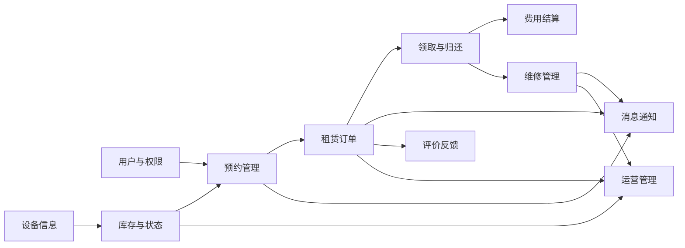
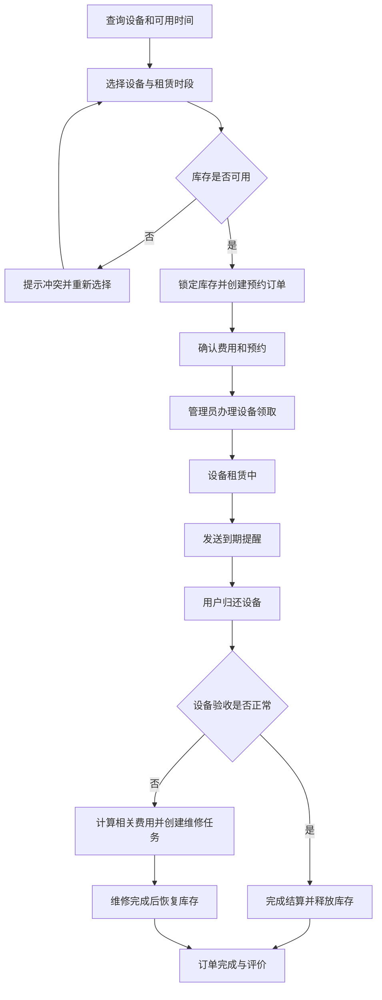
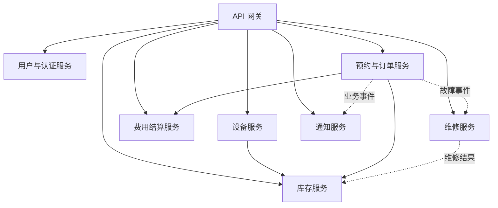

# 设备租赁与预约管理平台

> 面向需要短期使用摄影器材、实验设备或运动器材的用户，提供设备查询、时间段预约、库存锁定、租赁订单、领取归还、费用结算、维修管理和消息通知等服务。

## 项目简介

设备租赁与预约管理平台是一个贯穿本学期微服务课程的实践项目。平台以“设备从可租、预约、领取、使用、归还到再次可租”的完整生命周期为主线，为租赁用户和设备管理人员提供统一、透明且可追踪的业务处理流程。

项目初期将以单体应用完成核心业务建模和基础功能，后续结合课程进度逐步引入数据库持久化、身份认证与权限控制、微服务拆分、消息队列、分布式事务、监控告警以及容器化部署等能力。

## 业务背景

摄影器材、实验设备和运动器材通常价格较高，但用户往往只需要在特定时间段内短期使用。传统租赁业务依赖电话、即时通信工具或纸质表格登记，容易出现以下问题：

- 用户无法及时了解设备是否可租，查询和预约效率低。
- 多人同时预约时可能发生时间冲突或超额出租。
- 领取、归还、续租和逾期信息分散，难以追踪设备状态。
- 租金、押金、逾期费用和损坏赔偿缺少统一的计算与记录方式。
- 设备故障和维修过程缺少闭环管理，可能将故障设备再次出租。
- 到期提醒依赖人工发送，容易遗漏并增加管理成本。

本项目希望通过统一的平台连接用户、设备管理员、维修人员和平台管理员，让设备状态、预约时间、租赁订单和费用记录全程可查询、可追踪。

## 目标用户与需求

| 用户角色 | 主要需求 |
| --- | --- |
| 租赁用户 | 查询设备和可用时间，提交或取消预约，查看订单，领取、续租和归还设备，接收到期提醒，查看费用明细 |
| 设备管理员 | 维护设备资料和库存，审核预约，办理领取与归还，验收设备，处理逾期和损坏情况 |
| 维修人员 | 接收维修任务，登记检测结果和维修进度，完成维修并反馈设备是否可以重新出租 |
| 平台管理员 | 管理用户、角色、设备分类和业务规则，查看运营数据、异常订单和系统运行情况 |

## 选题原因

设备租赁是一个具体且常见的业务场景，包含设备、库存、预约、订单、费用和维修等多个相互关联的业务对象，能够形成完整的业务闭环。该场景既可以从规模适中的单体应用开始实现，也能自然地拆分为多个边界清晰的微服务。

库存锁定、预约超时、费用结算和设备状态流转能够用于实践并发控制与事务一致性；到期提醒和维修通知适合引入异步消息；不同用户角色适合实现认证与授权；订单量、设备利用率和异常状态则可以用于监控和可观测性实践。因此，该选题适合作为本学期持续演进的课程项目。

## 项目目标与适用场景

### 项目目标

- 为用户提供清晰的设备信息、可租时间和在线预约能力。
- 通过库存锁定和时间冲突校验，避免同一设备被重复预约。
- 记录预约、领取、使用、归还和结算全过程，确保业务可追踪。
- 建立设备故障与维修闭环，保证可租设备状态真实可靠。
- 为后续微服务架构实践提供边界明确、可持续演进的业务基础。

### 适用场景

- 摄影工作室的相机、镜头、灯光和脚架租赁。
- 学校或实验室的仪器、测量工具和实验套件预约。
- 体育场馆或社团的球拍、护具和训练器材租借。
- 企业内部的会议设备、展示设备和办公器材借用。

## 功能模块

| 功能模块 | 主要功能 |
| --- | --- |
| 用户与权限 | 用户注册与登录、个人资料、角色管理、账号状态管理 |
| 设备分类与信息 | 设备分类、设备详情、图片、租赁规则、上下架管理 |
| 库存与状态 | 可用库存查询、时间冲突校验、库存锁定与释放、设备状态变更 |
| 预约管理 | 按时间段预约、预约审核、取消预约、超时自动关闭 |
| 租赁订单 | 创建订单、订单查询、领取确认、续租申请、归还验收、订单状态跟踪 |
| 费用结算 | 租金与押金计算、逾期费用、损坏赔偿、费用明细记录 |
| 维修管理 | 故障登记、维修任务分配、维修进度、检测结果、维修完成后重新上架 |
| 消息通知 | 预约结果、领取提醒、到期提醒、逾期通知、维修状态通知 |
| 评价反馈 | 完成订单后的设备评价、服务评价和问题反馈 |
| 运营管理 | 设备利用率、热门设备、逾期订单、维修情况和费用统计 |

## 核心业务流程

以用户正常完成一次设备租赁为例：

1. 用户登录平台，按照设备类型和使用时间查询可租设备。
2. 用户选择设备及租赁时间段，提交预约申请。
3. 系统校验时间冲突并锁定对应库存，随后创建预约订单。
4. 用户确认费用；预约通过后，系统发送领取通知。
5. 设备管理员核验订单并办理领取，设备状态变更为“租赁中”。
6. 租期临近结束时，系统向用户发送到期提醒。
7. 用户归还设备，设备管理员检查设备状态并登记验收结果。
8. 系统计算租金、逾期费用或损坏赔偿，完成费用结算。
9. 验收正常的设备恢复为“可租”；存在故障的设备进入维修流程。
10. 订单完成后，用户可以对设备和服务进行评价。

## 核心业务规则

- 同一台设备在时间有重叠的订单中只能被成功预约一次。
- 预约成功后库存进入锁定状态；预约取消或超时未确认时自动释放。
- 只有状态为“可租”的设备才能参与预约和库存锁定。
- 设备领取后进入“租赁中”状态，归还验收完成前不得再次出租。
- 验收发现故障时，设备进入“维修中”状态，维修完成并确认可用后才能重新上架。
- 续租申请必须再次进行时间冲突校验，不能影响后续已生效的预约。
- 逾期费用和损坏赔偿需要保留计算依据与处理记录。

## 当前项目范围

项目第一阶段聚焦于设备租赁的核心闭环，计划实现：

- 基础用户与角色管理。
- 设备分类、设备信息和库存状态管理。
- 时间段查询、预约、取消和库存锁定。
- 租赁订单、领取、归还和状态流转。
- 基础费用计算、维修登记和站内通知。

### 暂不实现

为控制课程项目初期的规模，第一阶段暂不实现：

- 对接真实银行、微信或支付宝支付，费用仅记录模拟支付结果。
- 自营物流配送和跨地区设备调拨。
- 实时聊天、直播验机和复杂的信用评分模型。
- 面向多商家的开放入驻、佣金结算和营销活动系统。
- 基于人工智能的设备推荐或故障识别。

## 后续演进方向

| 演进阶段 | 计划内容 |
| --- | --- |
| 数据持久化 | 设计用户、设备、库存、预约、订单、费用、维修和通知等数据表，引入数据库迁移与缓存 |
| 认证与权限 | 引入统一认证，按照租赁用户、设备管理员、维修人员和平台管理员实施角色权限控制 |
| 服务拆分 | 根据业务边界拆分用户、设备、库存、订单、结算、维修和通知服务，并建设 API 网关与服务注册发现 |
| 消息机制 | 使用消息队列处理预约结果、库存释放、到期提醒、维修通知和运营事件 |
| 分布式事务 | 对创建订单、锁定库存和费用确认等跨服务流程采用 Saga、补偿机制或最终一致性方案 |
| 稳定性建设 | 增加接口幂等、限流、熔断、重试、超时处理和异常订单补偿任务 |
| 监控与追踪 | 建设日志、指标、链路追踪和告警，关注接口耗时、库存锁定失败率和订单异常率 |
| 容器化部署 | 使用 Docker 打包服务，通过持续集成完成测试和构建，并逐步部署到容器编排环境 |

## 初步服务边界

项目早期采用单体架构，待核心业务稳定后再按以下边界逐步拆分：

> 上图仅表示后续可能的服务边界。项目不会在业务尚未稳定时过早拆分，而是先完成单体版本，再结合课程内容逐步演进。

## 课程信息

- 课程：微服务开发与实践
- 姓名：汪哲
- 学号：2401110631

## 仓库说明

本仓库用于记录微服务课程的学习与项目实践。后续课程作业将在本仓库中持续完成，包括需求分析、功能实现、测试、服务拆分、监控、部署和相关文档整理。
