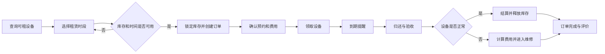

# 第 02 周作业：项目选题与功能规划

## 项目选题

### 最终选题

**设备租赁与预约管理平台**

本项目面向需要短期使用摄影器材、实验设备或运动器材的用户，提供设备查询、时间段预约、库存锁定、租赁订单、领取归还、费用结算、维修管理和消息通知等功能。平台以设备的完整生命周期为主线，统一记录设备从可租、预约、领取、使用、归还、维修到再次可租的状态变化。

### 选题确定过程

在确定课程项目时，首先比较了购物系统、宠物医院系统、健身房预约系统和设备租赁系统等方向，并从业务完整性、实现难度、微服务拆分空间和后续课程内容适配度四个方面进行分析。

| 候选方向 | 优点 | 主要考虑 |
| --- | --- | --- |
| 购物系统 | 商品、订单、库存和支付流程成熟，参考资料丰富 | 题目较常见，项目容易停留在通用商城功能 |
| 宠物医院系统 | 用户角色清晰，包含预约、诊疗、病历和收费流程 | 医疗业务规则和病历权限相对复杂 |
| 健身房预约系统 | 课程、教练、会员和签到关系明确，开发难度适中 | 事务一致性和设备状态管理场景相对有限 |
| 设备租赁系统 | 兼具预约、库存、订单、费用、维修和通知，业务闭环完整 | 需要合理控制初期范围，避免一次实现过多功能 |

经过比较，最终选择设备租赁与预约管理平台。该方向业务背景具体，同时包含多人预约冲突、库存锁定、订单状态流转、逾期费用和设备维修等问题，既能完成基础的 Java 和数据库实践，也适合后续逐步引入微服务相关技术。

### 业务背景与实际问题

摄影器材、实验设备和运动器材通常价格较高，用户往往只在特定时间段内有短期使用需求。传统租赁业务经常通过电话、即时通信工具或纸质表格登记，容易出现设备状态不透明、预约时间冲突、领取归还记录分散、费用计算不清晰以及到期提醒遗漏等问题。

本项目希望建立统一的线上平台，让用户能够查询设备及其可用时间并完成预约，让管理人员能够追踪设备、订单、费用和维修状态，从而提高租赁效率并减少人工登记错误。

### 目标用户

- **租赁用户**：查询可租设备和时间，提交或取消预约，查看订单、费用和到期提醒。
- **设备管理员**：维护设备与库存，审核预约，办理领取和归还，处理逾期及损坏情况。
- **维修人员**：接收维修任务，登记检测结果和维修进度，确认设备是否可以重新出租。
- **平台管理员**：管理用户、角色、设备分类和业务规则，查看运营数据与异常订单。

### 选择原因

1. 业务对象丰富，包含用户、设备、库存、预约、订单、费用、维修和通知，可以形成完整业务闭环。
2. 多人预约同一设备的场景适合实践并发控制、库存锁定和事务一致性。
3. 到期提醒、库存释放和维修通知适合在后续课程中引入消息队列。
4. 多种用户角色能够支持身份认证和细粒度权限控制的实践。
5. 各功能边界较清晰，可以从单体应用开始，再逐步拆分为用户、设备、库存、订单、结算、维修和通知等服务。
6. 订单量、设备利用率、库存锁定失败率和异常订单等指标适合用于监控、日志和链路追踪实践。

### 项目初步边界

项目第一阶段聚焦设备租赁的核心流程，包括用户与角色管理、设备资料、库存状态、时间段预约、租赁订单、领取归还、基础费用计算、维修登记和站内通知。

为了控制初期规模，暂不对接真实支付平台，不实现自营物流、多商家入驻、实时聊天、复杂信用评分和人工智能推荐等功能。后续将按照课程进度逐步加入数据库持久化、统一认证、服务拆分、消息队列、分布式事务、系统监控和容器化部署，使项目能够贯穿整个学期持续演进。

## 功能规划

### 用户角色规划

| 用户角色 | 主要功能 |
| --- | --- |
| 租赁用户 | 查询设备与可用时间、提交或取消预约、查看租赁订单、领取和归还设备、查看费用及通知、完成评价 |
| 设备管理员 | 维护设备和库存、审核预约、办理领取与归还、验收设备、处理逾期及损坏情况 |
| 维修人员 | 接收维修任务、登记检测结果、更新维修进度、确认设备是否可以重新出租 |
| 平台管理员 | 管理用户与角色、维护设备分类和业务规则、查看运营数据、处理异常订单 |

### 功能模块规划

| 功能模块 | 计划功能 |
| --- | --- |
| 用户与权限 | 用户注册与登录、个人资料、角色管理和账号状态管理 |
| 设备信息 | 设备分类、设备详情、图片、租赁规则和上下架管理 |
| 库存与状态 | 可用库存查询、预约冲突校验、库存锁定与释放、设备状态变更 |
| 预约管理 | 分时预约、预约审核、取消预约和超时关闭 |
| 租赁订单 | 创建订单、订单查询、领取确认、续租、归还验收和状态跟踪 |
| 费用结算 | 租金、押金、逾期费用、损坏赔偿和费用明细记录 |
| 维修管理 | 故障登记、维修任务分配、维修进度和设备重新上架 |
| 消息通知 | 预约结果、领取提醒、到期提醒、逾期通知和维修状态通知 |
| 评价反馈 | 订单完成后的设备评价、服务评价和问题反馈 |
| 运营管理 | 设备利用率、热门设备、逾期订单、维修情况和费用统计 |

### 核心业务流程

1. 用户按照设备类型和使用时间查询可租设备。
2. 用户选择设备与租赁时间段并提交预约。
3. 系统校验时间冲突，成功后锁定库存并创建预约订单。
4. 用户确认费用，设备管理员根据订单办理设备领取。
5. 设备进入租赁状态，系统在租期结束前发送到期提醒。
6. 用户归还设备，设备管理员完成验收并登记设备状态。
7. 系统计算租金、逾期费用或损坏赔偿，并完成结算。
8. 正常设备释放库存，故障设备进入维修流程。
9. 订单完成后，用户可以对设备和服务进行评价。

### 本周完成内容

- 确定“设备租赁与预约管理平台”为本学期持续演进的唯一课程项目。
- 分析项目业务背景、目标用户、实际问题和选题原因。
- 明确租赁用户、设备管理员、维修人员和平台管理员四类角色及其需求。
- 完成用户、设备、库存、预约、订单、费用、维修、通知、评价和运营等功能模块的初步划分。
- 梳理从查询设备、预约、库存锁定、领取、归还、费用结算到维修处理的核心业务流程。
- 明确项目第一阶段范围以及暂不实现的功能，避免初期开发范围过大。
- 规划数据库持久化、认证授权、服务拆分、消息队列、分布式事务、监控和部署等后续演进方向。
- 完善仓库根目录 `README.md`，使其成为项目说明入口。

### 后续计划

1. **领域建模**：进一步分析用户、设备、库存、预约、订单、费用和维修等核心实体，明确实体之间的关系及状态变化。
2. **接口设计**：根据核心业务流程设计 RESTful API、请求参数、响应结构和统一异常处理方式。
3. **单体实现**：使用 Java 和 Spring Boot 完成第一版单体应用，优先实现设备查询、预约、订单、领取和归还流程。
4. **数据持久化**：设计关系型数据库表结构，实现数据校验、事务处理和数据库版本管理。
5. **认证授权**：实现登录认证，并根据不同用户角色控制接口和数据访问权限。
6. **服务拆分**：在核心业务稳定后，逐步拆分用户、设备、库存、订单、费用、维修和通知服务。
7. **消息与事务**：引入消息队列处理到期提醒等异步任务，并为订单创建、库存锁定和费用确认设计最终一致性方案。
8. **质量保障**：补充单元测试、接口测试和核心流程集成测试，引入接口幂等、限流、熔断与重试机制。
9. **监控与部署**：建设日志、指标和链路追踪，使用 Docker 完成服务打包，并逐步实现持续集成和容器化部署。
